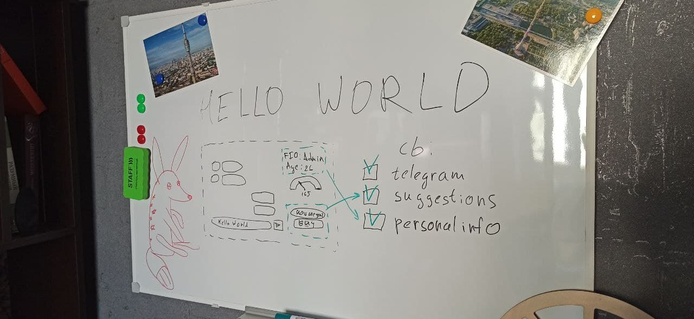
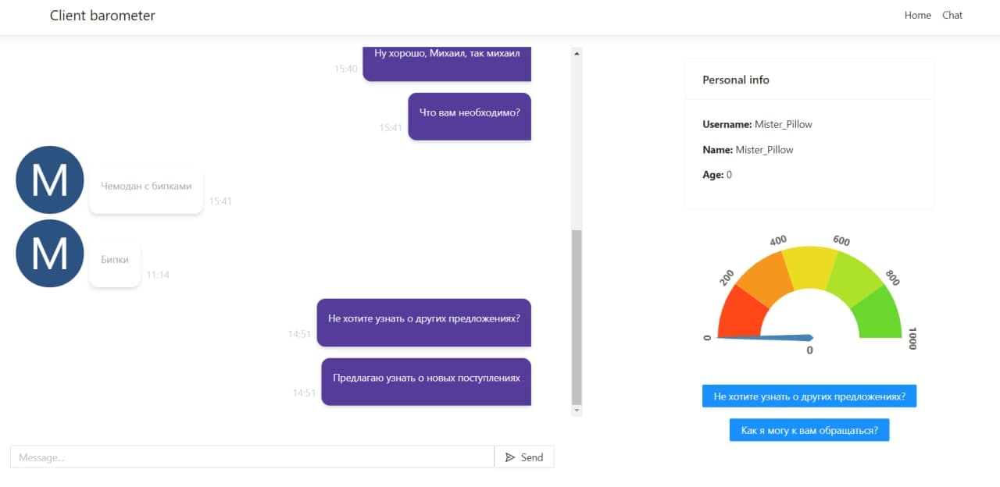

# Барометр клиента

Приложение представляет собой сайт для работы менеджеров по продажам с холодными обзвонами.




## Состав

Сервис состоит из 5 сервисов:
* back - бекенд на .net
* front - NodeJS + react
* db - база данных mysql
* ngrok - сервер для проксирования запросов через ssl тунель для работы с telegram
* predictor - ML с предсказаниями

## back

Бекенд на .net.

Для работы с telegram необходим токен бота в `appsettings.Development.json`. Для тестирования с локальной машины токен реального бота можно попросить у админа репы, либо создать своего бота через https://botcreators.ru/blog/botfather-instrukciya/.

## front

Фронтенд на NodeJS + react.

## db

База данных mysql.

## ngrok

Сервис, помогающий создавать ssl-тунель с локальной машины. Это необходимо для работы с telegram.

Для его запуска необходим ngrok-token, который можно получить при регистрации на сайте https://ngrok.com/. Бесплатный токен дает только 1 тунель, поэтому каждому разработчику нужен свой. Токен указывается в файле `.env` в корне проекта.

## predictor

ML-сервис на python.

## Как запустить локально

### 1. Все в Docker

Все сервисы обернуты в docker и запускаются через docker-compose:
```
docker-compose up -d --build
```

Для правильной работы и подключения есть 3 файла конфигурации, которые можно взять из примеров:
* example.env -> .env (Необходимо добавить Ngrok токен см. [ngrok](#ngrok))
* src/Front/exmaple.env -> src/Front/.env
* src/ClientBarometer/example.appsettings.Development.json -> src/ClientBarometer/appsettings.Development.json (Необходимо добавить телеграм токен см. [back](#back))

### 2. Только фронт

Можно запустить отдельно фронт через `yarn`. Для этого необходимо установить NodeJS и yarn. Затем выполнить команду
```
yarn start
```

Api, к которому обращается фронт указывается в файле `.env`. По умолчанию - localhost:5000.

### 3. Только бек

Необходим установленный dotnet и Rider (либо Visual Studio).
